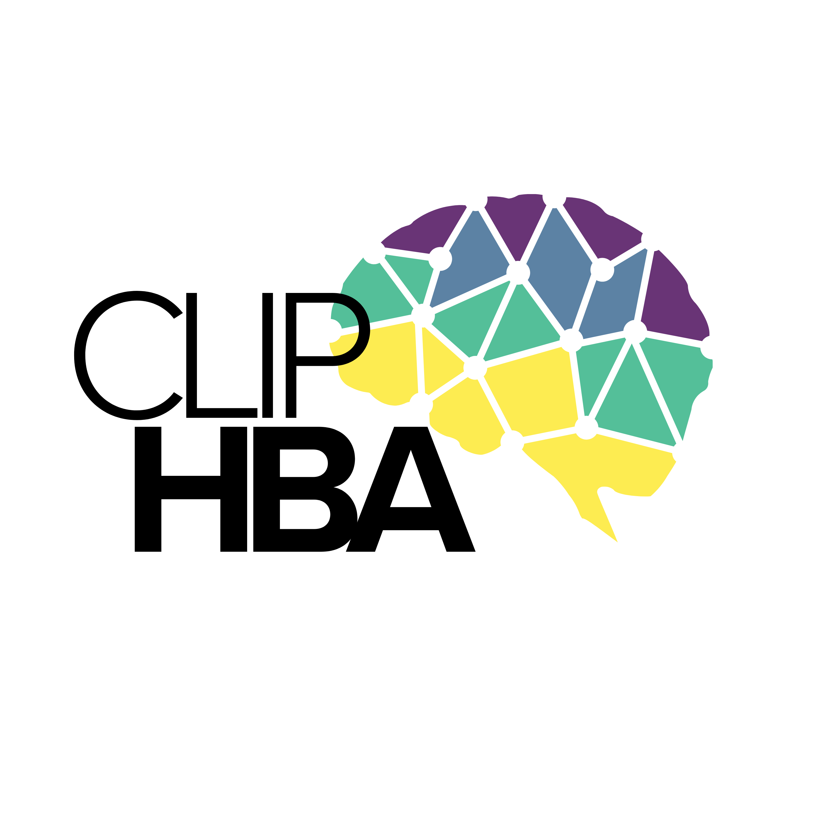

<h1 align="center"> 
    
</h1>


<h1 align="center">
    <p> Shifting Attention to You: Personalized Brain-Inspired AI Models <br></p>
</h1>

<h3 align="center">
    <p> Stephen Chong Zhao, Yang Hu, Jason Lee, Andrew Bender, Trisha Mazumdar, Mark Wallace, David A. Tovar <br></p>
</h3>

<p align="center">
  <a href="https://arxiv.org/abs/2502.04658"><b>Paper</b></a> |
  <a href="#citation"><b>BibTeX</b></a>
</p>


# Overview

This repository contains all the key training, inference, and visualization script for behavioral/meg fine-tuning with the CLIP architecture. 

# Abstract

The integration of human and artificial intelligence represents a scientific opportunity to advance our understanding of information processing, as each system offers unique computational insights that can enhance and inform the other. The synthesis of human cognitive principles with artificial intelligence has the potential to produce more interpretable and functionally aligned computational models, while simultaneously providing a formal framework for investigating the neural mechanisms underlying perception, learning, and decision-making through systematic model comparisons and representational analyses. In this study, we introduce personalized brain-inspired modeling that integrates human behavioral embeddings and neural data to align with cognitive processes. We took a stepwise approach, fine-tuning the Contrastive Language-Image Pre-training (CLIP) model with large-scale behavioral decisions, group-level neural data, and finally, participant-level neural data within a broader framework that we have named CLIP-Human-Based Analysis (CLIP-HBA). We found that fine-tuning on behavioral data enhances its ability to predict human similarity judgments while indirectly aligning it with dynamic representations captured via MEG. To further gain mechanistic insights into the temporal evolution of cognitive processes, we introduced a model specifically fine-tuned on millisecond-level MEG neural dynamics (CLIP-HBA-MEG). This model resulted in enhanced temporal alignment with human neural processing while still showing improvement on behavioral alignment. Finally, we trained individualized models on participant-specific neural data, effectively capturing individualized neural dynamics and highlighting the potential for personalized AI systems. These personalized systems have far-reaching implications for the fields of medicine, cognitive research, human-computer interfaces, and AI development.


# Code Structure: 

```
├───CLIP-HBA
│   ├───Data # Location for training data and annotations
│   │   
│   ├───figures
│   ├───functions # source code for training and inference pipelines
│   │   
│   ├───models
│   │   ├───cliphba_behavior_text_encoder # partial text encoder model weights for the CLIP-HBA-Behavior model, for MEG training
│   │   ├───cliphba_meg_individual # Individual model weights
│   
├───output # output location for all the inference pipelines
|
└───src # all model backend source code for CLIP
    |...
    ├───models # Model archiectures
    ...

```

# Environment Setup:

```
conda create -n cliphba python=3.8.18
conda activate cliphba

conda install pytorch=1.10.2 torchvision cudatoolkit=11.3 -c pytorch

pip install openmim
mim install mmcv-full==1.5.0
pip install -r requirements.txt
```

download the pretrained CLIP-HBA model weights from [here](https://drive.google.com/file/d/1_X9w3ttJt419gb8hosBbHSbG3WwRQ2GW/view?usp=share_link)


# Running the Model

## Training

#### Behavioral Training - Things Dataset
```
python /CLIP-HBA/train_behavior.py
```


#### MEG Group Level Training - Things MEG Data with 3 Participants
```
python /CLIP-HBA/train_meg_group.py
```

#### MEG Group Level Training - 118 Images with 15 Participants
```
python /CLIP-HBA/train_meg_individual.py
```

## Inference

#### CLIP-HBA-Behavior Inference - Behavior/Static Embeddings and RDMs 
```
python /CLIP-HBA/inference_behavior.py
```

#### CLIP-HBA-MEG (Group-Trained) Inference - MEG/Dynamic Embeddings and RDMs 
```
python /CLIP-HBA/inference_meg_group.py
```

#### CLIP-HBA-MEG (Individuals) inference - MEG/Dynamic Individual Embeddings and RDMs for each Participants
```
python /CLIP-HBA/inference_meg_individual.py
```

# Citation: 
```
@misc{zhao2025shiftingattentionyoupersonalized,
      title={Shifting Attention to You: Personalized Brain-Inspired AI Models}, 
      author={Stephen Chong Zhao and Yang Hu and Jason Lee and Andrew Bender and Trisha Mazumdar and Mark Wallace and David A. Tovar},
      year={2025},
      eprint={2502.04658},
      archivePrefix={arXiv},
      primaryClass={q-bio.NC},
      url={https://arxiv.org/abs/2502.04658}, 
}
```


# Opensourced Training Data

## THINGS
Download Things-MEG Data from [here](https://plus.figshare.com/articles/dataset/THINGS-data_MEG_preprocessed_dataset/21215246?backTo=/collections/THINGS-data_A_multimodal_collection_of_large-scale_datasets_for_investigating_object_representations_in_brain_and_behavior/6161151)

## Things Image Set
Things Things Image Dataset can be downloaded from [here](https://osf.io/jum2f/)
