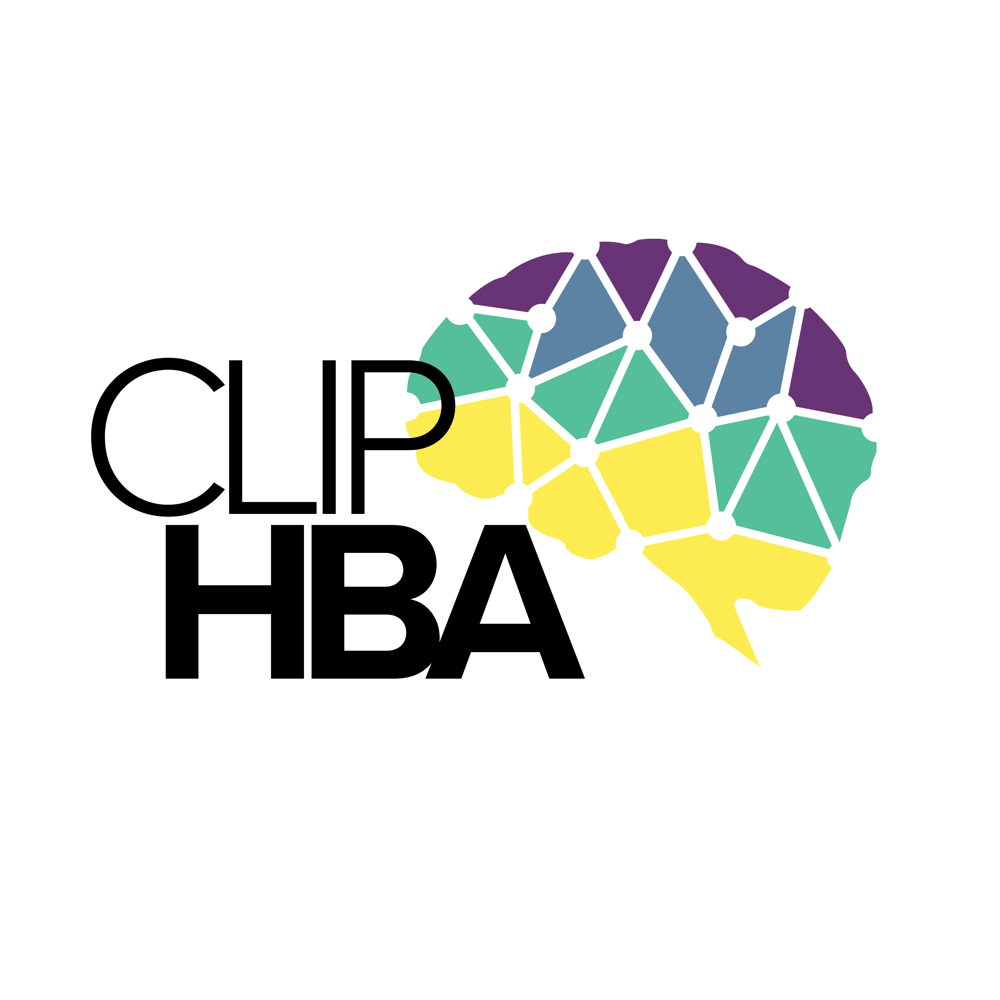

<h1 align="center"> 
    
</h1>

<h1 align="center">
    <p> Memorability Prediction with CLIP-HBA </p>
</h1>

<h3 align="center">
    Tovar Brain Inspired AI Lab, Vanderbilt University
</h3>

---

## Overview

**CLIP-HBA-Mem** predicts image memorability using brain-aligned visual representations from [CLIP-HBA](https://github.com/stephenczhao/CLIP-HBA-Official). This repository is a fork of [CLIP-HBA-Official](https://github.com/stephenczhao/CLIP-HBA-Official), which provides the training and inference pipelines for **CLIP-HBA-Behavior** (behavioral fine-tuning) and **CLIP-HBA-MEG** (MEG neural dynamics fine-tuning). The memorability prediction work built on top of this foundation is the contribution of this project.

The core idea: a frozen CLIP-HBA-Behavior backbone extracts semantically-grounded image features, and a lightweight MLP head is trained on top to produce human memorability scores. By leveraging representations already aligned with human perception, CLIP-HBA-Mem captures what makes images memorable without requiring end-to-end training.

## How It Relates to CLIP-HBA

The [CLIP-HBA framework](https://arxiv.org/abs/2502.04658) fine-tunes CLIP (ViT-L/14) on human data in two stages:

1. **CLIP-HBA-Behavior** -- Fine-tuned on the THINGS dataset using large-scale behavioral similarity judgments and DoRA adaptation. Produces static embeddings aligned with human perceptual similarity.
2. **CLIP-HBA-MEG** -- Fine-tuned on millisecond-level MEG neural data, capturing the temporal dynamics of visual processing.

Both of these training pipelines are preserved in this fork under `CLIP-HBA/train_behavior.py` and `CLIP-HBA/train_meg_group.py` / `CLIP-HBA/train_meg_individual.py`. See the [original repository](https://github.com/stephenczhao/CLIP-HBA-Official) and [paper](https://arxiv.org/abs/2502.04658) for full details.

**CLIP-HBA-Mem** builds on this by adding a memorability prediction MLP head on top of the frozen CLIP-HBA-Behavior backbone.

**MEGMem** builds on this by adding a memorability prediction MLP head on top of the frozen CLIP-HBA-MEG backbone at each timepoint.

## Memorability Models

Three model variants are supported:

| Model | Backbone | Adaptation | Description |
|-------|----------|------------|-------------|
| `clip_hba_mem` | CLIP-HBA-Behavior | DoRA (frozen) | MLP head on behavior-aligned features |
| `MEGMem` | CLIP-HBA-MEG | DoRA + MEG-specific parameters (frozen) | MLP head on brain-aligned features at each timepoint |
| `clip_frozen_mlp` | Vanilla CLIP ViT-L/14 | None (frozen) | Baseline: MLP head on standard CLIP features |
| `perceptclip` | CLIP ViT-L/14 | LoRA | LoRA-adapted CLIP + MLP head ([HuggingFace](https://huggingface.co/PerceptCLIP/PerceptCLIP_Memorability)) |

All models are trained with MSE loss, early stopping (patience 20), and 10-fold cross-validation on LaMem + MemCat (~60K images combined). Evaluation uses Spearman rank correlation against ground-truth memorability scores.

### MEG-Based Memorability

CLIP-HBA-Mem also includes a temporal memorability analysis using CLIP-HBA-MEG embeddings. An MLP head is trained independently at each of **281 MEG timepoints** (-100 to 1300 ms at 5 ms resolution), producing a time-resolved profile of how memorability information emerges in brain-aligned representations.

## Repository Structure

```
CLIP-HBA-Mem/
├── CLIP-HBA/
│   ├── train_mem.py                    # Train CLIP-HBA-Mem (main entry point)
│   ├── train_mem_meg.py                # Train MEG-based memorability (per timepoint)
│   ├── train_clip_mlp.py               # Train frozen CLIP baseline
│   ├── inference_mem.py                # Run memorability inference
│   ├── inference_mem_meg.py            # Run MEG memorability inference
│   ├── extract_embeddings.py           # Precompute backbone embeddings
│   ├── extract_embeddings_meg.py       # Precompute MEG embeddings
│   │
│   ├── functions/                      # Core pipelines
│   │   ├── train_mem_pipeline.py       # Memorability model definitions & training loop
│   │   ├── train_behavior_things_pipeline.py   # CLIP-HBA-Behavior training
│   │   ├── train_meg_things_pipeline.py        # CLIP-HBA-MEG training
│   │   └── inference_*.py              # Inference pipelines
│   │
│   ├── Data/                           # Datasets, annotations, splits
│   │   ├── combined_lamem_memcat/      # 10-fold cross-validation splits
│   │   └── ...
│   │
│   ├── models/                         # Trained checkpoints
│   │
│   ├── train_behavior.py               # CLIP-HBA-Behavior training (from upstream)
│   ├── train_meg_group.py              # CLIP-HBA-MEG group training (from upstream)
│   ├── train_meg_individual.py         # CLIP-HBA-MEG individual training (from upstream)
│   ├── inference_behavior.py           # Behavior inference (from upstream)
│   ├── inference_meg_group.py          # MEG group inference (from upstream)
│   └── inference_meg_individual.py     # MEG individual inference (from upstream)
│
├── src/                                # CLIP model architectures
│   └── models/CLIPs/
│       ├── clip/                       # Vanilla CLIP
│       ├── clip_hba/                   # CLIP-HBA-Behavior (with DoRA)
│       └── clip_hba_meg/               # CLIP-HBA-MEG (temporal)
│
└── requirements.txt
```

## Environment Setup

```bash
conda create -n cliphba python=3.11
conda activate cliphba

pip3 install torch torchvision torchaudio --index-url https://download.pytorch.org/whl/cu118
pip3 install -r requirements.txt
```

Download the pretrained CLIP-HBA model weights from [INSERT LINK].

## Usage

### Training Memorability Models

```bash
cd CLIP-HBA

# Train CLIP-HBA-Mem (DoRA backbone, fold 1)
FOLD=1 python train_mem.py

# Train frozen CLIP baseline (fold 1)
FOLD=1 python train_clip_mlp.py

# Train MEG memorability head (single timepoint, single fold)
FOLD=1 TIMEPOINT_MS=100 python train_mem_meg.py
```

Training uses precomputed embeddings by default for speed. To precompute embeddings:

```bash
python extract_embeddings.py        # CLIP-HBA-Behavior embeddings
python extract_embeddings_meg.py    # CLIP-HBA-MEG embeddings (281 timepoints)
```

### Inference

```bash
cd CLIP-HBA

# CLIP-HBA-Mem on LaMem test set (fold 1)
python inference_mem.py --dataset lamem --fold 1

# All 5 LaMem folds
python inference_mem.py --dataset lamem --fold all

# Combined LaMem+MemCat, all 10 folds
python inference_mem.py --dataset combined_lamem_memcat --fold all

# Frozen CLIP baseline
python inference_mem.py --dataset lamem --fold 1 \
    --model_type clip_frozen_mlp \
    --checkpoint ./models/clip_frozen_mlp_fold{fold}.pth

# PerceptCLIP from HuggingFace
python inference_mem.py --dataset lamem --fold 1 \
    --model_type perceptclip --checkpoint huggingface

# THINGS dataset
python inference_mem.py --dataset things --things_img_dir ./Data/Things1854

# MemCat dataset
python inference_mem.py --dataset memcat
```

### CLIP-HBA Training (from upstream)

The original CLIP-HBA training pipelines are preserved:

```bash
cd CLIP-HBA

# Behavioral fine-tuning on THINGS
python train_behavior.py

# MEG group-level fine-tuning
python train_meg_group.py

# MEG individual-level fine-tuning
python train_meg_individual.py
```

## Datasets

| Dataset | Images | Splits | Description |
|---------|--------|--------|-------------|
| [LaMem](http://memorability.csail.mit.edu/) | 58,741 | 5-fold | Large-scale memorability dataset |
| [MemCat](https://github.com/gestaltrevision/memcat) | 10,000 | -- | Categorized memorability dataset |
| Combined | ~68,741 | 10-fold | LaMem + MemCat merged splits |
| [THINGS](https://osf.io/jum2f/) | 1,854 | -- | Object concepts (used for behavioral & MEG training) |

## Results

### Memorability Prediction (CLIP-HBA-Mem)

Performance is measured as Spearman rank correlation (ρ) between predicted and ground-truth memorability scores.  
All models use 5-fold cross-validation on LaMem and 10-fold on the combined LaMem+MemCat split.

| Model | Dataset | Spearman ρ (mean ± std) |
|-------|---------|------------------------|
| CLIP-HBA-Mem (`clip_hba_mem`) | LaMem (5-fold) | [INSERT] |
| Frozen CLIP + MLP (`clip_frozen_mlp`) | LaMem (5-fold) | [INSERT] |
| CLIP-HBA-Mem | LaMem + MemCat (10-fold) | [INSERT] |

> **Note:** Exact values depend on the random seed and hardware. Results above are representative ranges from training on a single NVIDIA A100 (40 GB). To reproduce, run `sbatch CLIP-HBA/train_mem.slurm` with the default config.

### Pre-trained Weights

Backbone checkpoint (`epoch97_dora_params.pth`) and trained MLP heads are available at:  
[INSERT LINK]

Place downloaded `.pth` files under `CLIP-HBA/Data/` and update the `backbone_checkpoint` path in `train_mem.py` accordingly.

### Hardware & Timing

| Task | Hardware | Approximate wall time |
|------|----------|-----------------------|
| LaMem 5-fold training (300 epochs each) | 1× A100 40 GB | ~8 h |
| Embedding extraction (all folds) | 1× A100 40 GB | ~1 h |
| Inference on LaMem test set | CPU or single GPU | < 5 min |

## Opensourced Training Data

- **THINGS MEG Data**: Download from [Figshare](https://plus.figshare.com/articles/dataset/THINGS-data_MEG_preprocessed_dataset/21215246?backTo=/collections/THINGS-data_A_multimodal_collection_of_large-scale_datasets_for_investigating_object_representations_in_brain_and_behavior/6161151)
- **THINGS Image Set**: Download from [OSF](https://osf.io/jum2f/)

## Citation

If you use CLIP-HBA-Mem, please cite the CLIP-HBA paper:

```bibtex
@misc{zhao2025shiftingattentionyoupersonalized,
      title={Shifting Attention to You: Personalized Brain-Inspired AI Models}, 
      author={Stephen Chong Zhao and Yang Hu and Jason Lee and Andrew Bender and Trisha Mazumdar and Mark Wallace and David A. Tovar},
      year={2025},
      eprint={2502.04658},
      archivePrefix={arXiv},
      primaryClass={q-bio.NC},
      url={https://arxiv.org/abs/2502.04658}, 
}
```

## Acknowledgments

This project is built on the [CLIP-HBA framework](https://github.com/stephenczhao/CLIP-HBA-Official) developed by Zhao et al. at Vanderbilt University.
